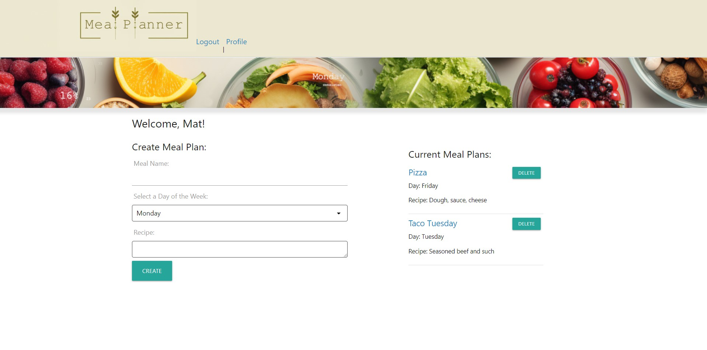

# Meal Planner

## Overview

Meal Planner is a web application designed to help users easily create and manage their meal plans. Users can add meals, set the day of the week, and write recipes, all in one place. The application also allows users to manage projects, each associated with different meals and plans.

The site can be accessed [here](https://github.com/jonesmatr/Meal-Planner.git).



## Table of Contents

1. [Features](#features)
2. [Technologies Used](#technologies-used)
3. [Installation](#installation)
4. [Usage](#usage)
5. [Contributing](#contributing)
6. [License](#license)

## Features

- **User Authentication**: Secure login and registration system.
- **Meal Management**: Add, edit, and delete meal plans.
- **Day Planning**: Assign meals to specific days of the week.
- **Recipe Storage**: Save recipes for each meal.
- **Project Management**: Associate meals with projects.

## Technologies Used

- Node.js
- Express.js
- Sequelize ORM
- MySQL
- Handlebars.js
- JavaScript
- HTML5
- CSS3
- Heroku (for deployment)

## Installation

1. Clone the repository:

    ```
    git clone https://github.com/jonesmatr/Meal-Planner.git
    ```

2. Navigate to the project directory:

    ```
    cd meal-planner
    ```

3. Install dependencies:

    ```
    npm install
    ```

4. Create a `.env` file to store your MySQL credentials and session secret:

    ```
    DB_NAME='crowdfund_db'
    DB_USER='root'
    DB_PASSWORD=''
    SESSION_SECRET='your_session_secret'
    ```

5. Initialize the database:

    ```
    npm run db-init
    ```

6. Start the server:

    ```
    npm start
    ```

7. Navigate to `http://localhost:3001/` in your browser.

## Usage

1. Register for an account or log in.
2. Navigate to the `Profile` page.
3. Use the form to create a new meal plan or project.
4. View your existing meal plans and projects.
5. Edit or delete meal plans and projects as needed.
